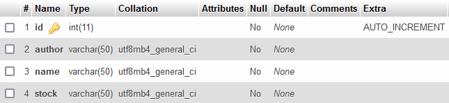
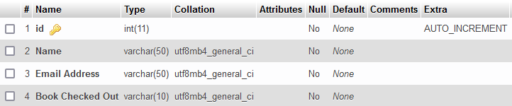

# Library Manager
This program is made to replicate a library that manages users checking out books and books in the library.
The library manager uses MySQL with phpMyAdmin to store user and book data.

## Get Started
Install [XAMPP Control Panel](https://www.apachefriends.org/index.html) with the `Apache` and `MySQL` modules to use phpMyAdmin.


## Usage
Run the XAMPP Control Panel and the Apache and MySQL Modules. 
In the Actions tab clicking on `Admin` for MySQL will redirect you to phpMyAdmin.
In phpMyAdmin create a new database called `library_database` with two tables called `books` and `users`.

`books` should have the following names and structures:



`users` should have the following names and structures:



In the method `connectToSQL()` you many need to change the port connection. For example my port is `3306`.

```java
connection = DriverManager.getConnection("jdbc:mysql://localhost:3306/library_database", "root", "");
```
On this line change `3360` to your port number. To find your port number look in the `Port(s)` column in MySQL row on XAMPP once you have started MySQL.

## Features

* Create New User Account (`New User`)
* Enter Existing User ID to procede with other functions. (`Existing User`)
* Add books to DB (`Library Staff`)
* Checkout Book
* Search for book in DB
  * Print out entire book list
  * Search by ID, Author, or Book Name
* Return a book

## Notes

No external jars needed.
